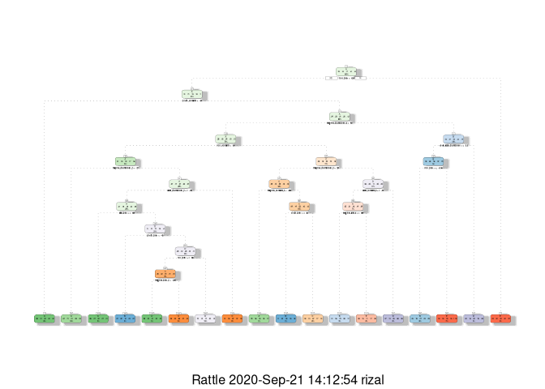
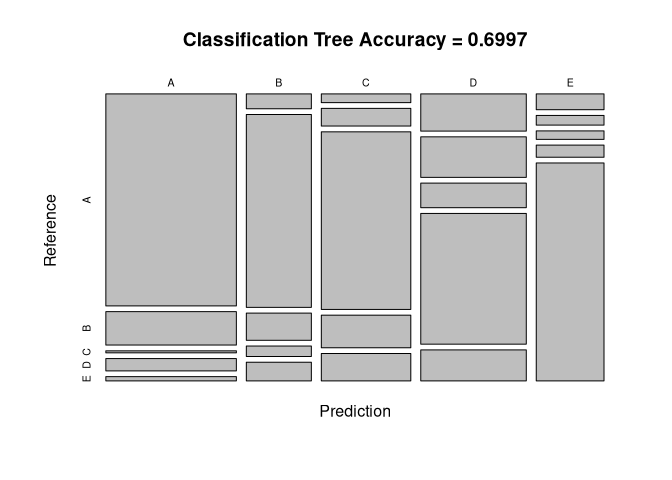
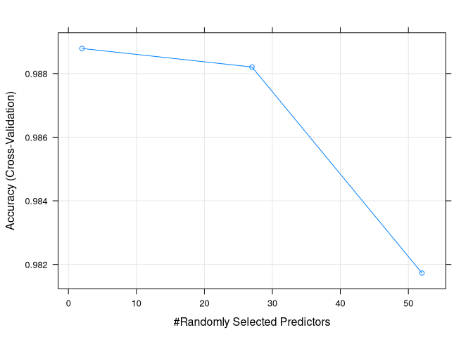
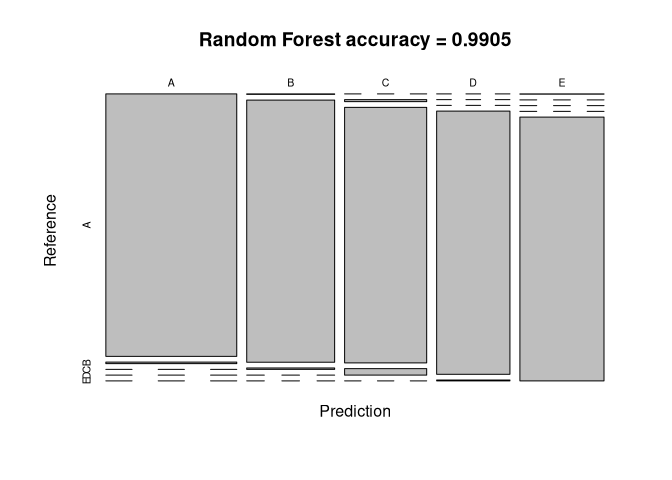
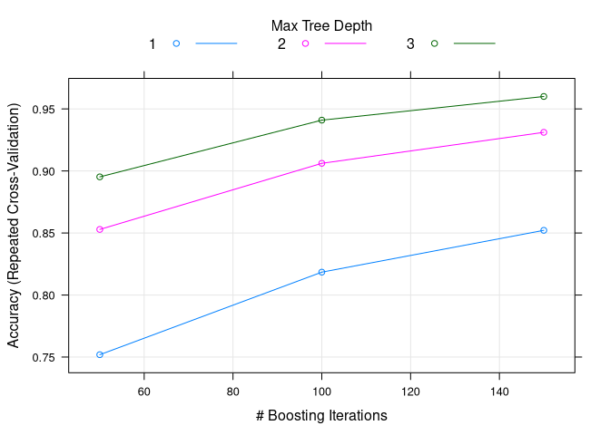
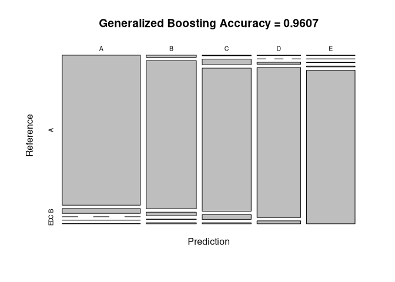

## Synopsis

In this project we will try to fit a model and predict the manner in which activity was done by a group of people. Six participants involved were equipped with devices having accelerometers on belt, forearm, arm and dumbbell. And each participant were told to perform barbell lifts correctly and incorrectly in five different ways. For more information on the data set, check 'Weight Lifting Exercises' on the [Groupware@LES](http://groupware.les.inf.puc-rio.br/har) site.

## Loading Data and processing

First, we will load necessary libraries required.


```r
library(caret)
library(rpart)
library(rattle)
library(dplyr)
```

We will check if data set is there in the working directory. If not, we will download it from the link provided.


```r
if(!file.exists("pml-training.csv")){
    trainUrl <- "https://d396qusza40orc.cloudfront.net/predmachlearn/pml-training.csv"
    download.file(trainUrl, destfile = "pml-training.csv", method = "curl")
}
if(!file.exists("pml-testing.csv")){
    testUrl <- "https://d396qusza40orc.cloudfront.net/predmachlearn/pml-testing.csv"
    download.file(testUrl, destfile = "pml-testing.csv", method = "curl")
    }
```

We will now load training and testing data sets from the csv files using R's `read.csv` function. We will use testing data given for validation. 


```r
training <- read.csv("pml-training.csv")
validation <- read.csv("pml-testing.csv")
```

Let's check the structure of the training data set with `str` function


```r
str(training)
```

```
## 'data.frame':	19622 obs. of  160 variables:
##  $ X                       : int  1 2 3 4 5 6 7 8 9 10 ...
##  $ user_name               : chr  "carlitos" "carlitos" "carlitos" "carlitos" ...
##  $ raw_timestamp_part_1    : int  1323084231 1323084231 1323084231 1323084232 1323084232 1323084232 1323084232 1323084232 1323084232 1323084232 ...
##  $ raw_timestamp_part_2    : int  788290 808298 820366 120339 196328 304277 368296 440390 484323 484434 ...
##  $ cvtd_timestamp          : chr  "05/12/2011 11:23" "05/12/2011 11:23" "05/12/2011 11:23" "05/12/2011 11:23" ...
##  $ new_window              : chr  "no" "no" "no" "no" ...
##  $ num_window              : int  11 11 11 12 12 12 12 12 12 12 ...
##  $ roll_belt               : num  1.41 1.41 1.42 1.48 1.48 1.45 1.42 1.42 1.43 1.45 ...
##  $ pitch_belt              : num  8.07 8.07 8.07 8.05 8.07 8.06 8.09 8.13 8.16 8.17 ...
##  $ yaw_belt                : num  -94.4 -94.4 -94.4 -94.4 -94.4 -94.4 -94.4 -94.4 -94.4 -94.4 ...
##  $ total_accel_belt        : int  3 3 3 3 3 3 3 3 3 3 ...
##  $ kurtosis_roll_belt      : chr  "" "" "" "" ...
##  $ kurtosis_picth_belt     : chr  "" "" "" "" ...
##  $ kurtosis_yaw_belt       : chr  "" "" "" "" ...
##  $ skewness_roll_belt      : chr  "" "" "" "" ...
##  $ skewness_roll_belt.1    : chr  "" "" "" "" ...
##  $ skewness_yaw_belt       : chr  "" "" "" "" ...
##  $ max_roll_belt           : num  NA NA NA NA NA NA NA NA NA NA ...
##  $ max_picth_belt          : int  NA NA NA NA NA NA NA NA NA NA ...
##  $ max_yaw_belt            : chr  "" "" "" "" ...
##  $ min_roll_belt           : num  NA NA NA NA NA NA NA NA NA NA ...
##  $ min_pitch_belt          : int  NA NA NA NA NA NA NA NA NA NA ...
##  $ min_yaw_belt            : chr  "" "" "" "" ...
##  $ amplitude_roll_belt     : num  NA NA NA NA NA NA NA NA NA NA ...
##  $ amplitude_pitch_belt    : int  NA NA NA NA NA NA NA NA NA NA ...
##  $ amplitude_yaw_belt      : chr  "" "" "" "" ...
##  $ var_total_accel_belt    : num  NA NA NA NA NA NA NA NA NA NA ...
##  $ avg_roll_belt           : num  NA NA NA NA NA NA NA NA NA NA ...
##  $ stddev_roll_belt        : num  NA NA NA NA NA NA NA NA NA NA ...
##  $ var_roll_belt           : num  NA NA NA NA NA NA NA NA NA NA ...
##  $ avg_pitch_belt          : num  NA NA NA NA NA NA NA NA NA NA ...
##  $ stddev_pitch_belt       : num  NA NA NA NA NA NA NA NA NA NA ...
##  $ var_pitch_belt          : num  NA NA NA NA NA NA NA NA NA NA ...
##  $ avg_yaw_belt            : num  NA NA NA NA NA NA NA NA NA NA ...
##  $ stddev_yaw_belt         : num  NA NA NA NA NA NA NA NA NA NA ...
##  $ var_yaw_belt            : num  NA NA NA NA NA NA NA NA NA NA ...
##  $ gyros_belt_x            : num  0 0.02 0 0.02 0.02 0.02 0.02 0.02 0.02 0.03 ...
##  $ gyros_belt_y            : num  0 0 0 0 0.02 0 0 0 0 0 ...
##  $ gyros_belt_z            : num  -0.02 -0.02 -0.02 -0.03 -0.02 -0.02 -0.02 -0.02 -0.02 0 ...
##  $ accel_belt_x            : int  -21 -22 -20 -22 -21 -21 -22 -22 -20 -21 ...
##  $ accel_belt_y            : int  4 4 5 3 2 4 3 4 2 4 ...
##  $ accel_belt_z            : int  22 22 23 21 24 21 21 21 24 22 ...
##  $ magnet_belt_x           : int  -3 -7 -2 -6 -6 0 -4 -2 1 -3 ...
##  $ magnet_belt_y           : int  599 608 600 604 600 603 599 603 602 609 ...
##  $ magnet_belt_z           : int  -313 -311 -305 -310 -302 -312 -311 -313 -312 -308 ...
##  $ roll_arm                : num  -128 -128 -128 -128 -128 -128 -128 -128 -128 -128 ...
##  $ pitch_arm               : num  22.5 22.5 22.5 22.1 22.1 22 21.9 21.8 21.7 21.6 ...
##  $ yaw_arm                 : num  -161 -161 -161 -161 -161 -161 -161 -161 -161 -161 ...
##  $ total_accel_arm         : int  34 34 34 34 34 34 34 34 34 34 ...
##  $ var_accel_arm           : num  NA NA NA NA NA NA NA NA NA NA ...
##  $ avg_roll_arm            : num  NA NA NA NA NA NA NA NA NA NA ...
##  $ stddev_roll_arm         : num  NA NA NA NA NA NA NA NA NA NA ...
##  $ var_roll_arm            : num  NA NA NA NA NA NA NA NA NA NA ...
##  $ avg_pitch_arm           : num  NA NA NA NA NA NA NA NA NA NA ...
##  $ stddev_pitch_arm        : num  NA NA NA NA NA NA NA NA NA NA ...
##  $ var_pitch_arm           : num  NA NA NA NA NA NA NA NA NA NA ...
##  $ avg_yaw_arm             : num  NA NA NA NA NA NA NA NA NA NA ...
##  $ stddev_yaw_arm          : num  NA NA NA NA NA NA NA NA NA NA ...
##  $ var_yaw_arm             : num  NA NA NA NA NA NA NA NA NA NA ...
##  $ gyros_arm_x             : num  0 0.02 0.02 0.02 0 0.02 0 0.02 0.02 0.02 ...
##  $ gyros_arm_y             : num  0 -0.02 -0.02 -0.03 -0.03 -0.03 -0.03 -0.02 -0.03 -0.03 ...
##  $ gyros_arm_z             : num  -0.02 -0.02 -0.02 0.02 0 0 0 0 -0.02 -0.02 ...
##  $ accel_arm_x             : int  -288 -290 -289 -289 -289 -289 -289 -289 -288 -288 ...
##  $ accel_arm_y             : int  109 110 110 111 111 111 111 111 109 110 ...
##  $ accel_arm_z             : int  -123 -125 -126 -123 -123 -122 -125 -124 -122 -124 ...
##  $ magnet_arm_x            : int  -368 -369 -368 -372 -374 -369 -373 -372 -369 -376 ...
##  $ magnet_arm_y            : int  337 337 344 344 337 342 336 338 341 334 ...
##  $ magnet_arm_z            : int  516 513 513 512 506 513 509 510 518 516 ...
##  $ kurtosis_roll_arm       : chr  "" "" "" "" ...
##  $ kurtosis_picth_arm      : chr  "" "" "" "" ...
##  $ kurtosis_yaw_arm        : chr  "" "" "" "" ...
##  $ skewness_roll_arm       : chr  "" "" "" "" ...
##  $ skewness_pitch_arm      : chr  "" "" "" "" ...
##  $ skewness_yaw_arm        : chr  "" "" "" "" ...
##  $ max_roll_arm            : num  NA NA NA NA NA NA NA NA NA NA ...
##  $ max_picth_arm           : num  NA NA NA NA NA NA NA NA NA NA ...
##  $ max_yaw_arm             : int  NA NA NA NA NA NA NA NA NA NA ...
##  $ min_roll_arm            : num  NA NA NA NA NA NA NA NA NA NA ...
##  $ min_pitch_arm           : num  NA NA NA NA NA NA NA NA NA NA ...
##  $ min_yaw_arm             : int  NA NA NA NA NA NA NA NA NA NA ...
##  $ amplitude_roll_arm      : num  NA NA NA NA NA NA NA NA NA NA ...
##  $ amplitude_pitch_arm     : num  NA NA NA NA NA NA NA NA NA NA ...
##  $ amplitude_yaw_arm       : int  NA NA NA NA NA NA NA NA NA NA ...
##  $ roll_dumbbell           : num  13.1 13.1 12.9 13.4 13.4 ...
##  $ pitch_dumbbell          : num  -70.5 -70.6 -70.3 -70.4 -70.4 ...
##  $ yaw_dumbbell            : num  -84.9 -84.7 -85.1 -84.9 -84.9 ...
##  $ kurtosis_roll_dumbbell  : chr  "" "" "" "" ...
##  $ kurtosis_picth_dumbbell : chr  "" "" "" "" ...
##  $ kurtosis_yaw_dumbbell   : chr  "" "" "" "" ...
##  $ skewness_roll_dumbbell  : chr  "" "" "" "" ...
##  $ skewness_pitch_dumbbell : chr  "" "" "" "" ...
##  $ skewness_yaw_dumbbell   : chr  "" "" "" "" ...
##  $ max_roll_dumbbell       : num  NA NA NA NA NA NA NA NA NA NA ...
##  $ max_picth_dumbbell      : num  NA NA NA NA NA NA NA NA NA NA ...
##  $ max_yaw_dumbbell        : chr  "" "" "" "" ...
##  $ min_roll_dumbbell       : num  NA NA NA NA NA NA NA NA NA NA ...
##  $ min_pitch_dumbbell      : num  NA NA NA NA NA NA NA NA NA NA ...
##  $ min_yaw_dumbbell        : chr  "" "" "" "" ...
##  $ amplitude_roll_dumbbell : num  NA NA NA NA NA NA NA NA NA NA ...
##   [list output truncated]
```
As you can see training data set has 19622 made on 160 variables. First 7 variables give us details of the subject and time stamps which we don't need to make our model. Some variables are recorded as `character`. We will convert them into `numeric` type. 


```r
# for training data
training <- training %>%
  as_tibble() %>%
  select(-(1:7)) %>%
  mutate(across(1:ncol(.)-1, as.numeric), classe = as.factor(classe))
# for validation data
validation <- validation %>%
  as_tibble() %>%
  select(-(1:7)) %>%
  mutate(across(1:ncol(.)-1, as.numeric))
```

We will now check number of NA values in each variables


```r
NAsum <- colSums(is.na(training))
unique(NAsum)
```

```
##  [1]     0 19226 19248 19622 19225 19216 19294 19296 19227 19293 19221 19218
## [13] 19220 19217 19300 19301 19299
```

As we can see above, if we take a look on unique set of the number of NA values for each variable, we can understand that some sets have 0 NA values but others are mostly full of NA values. So we will only take those with 0 NA values into consideration to make this model.


```r
noNAindex <- which(NAsum == 0)
training <- training[, noNAindex]
validation <- validation[, noNAindex]
```

We can check whether there are any variables with near zero variance with `caret` package's `nearZeroVar` function.


```r
nearZeroVar(training)
```

```
## integer(0)
```

## Training Data

We will use the 70% of training data set for training and the rest for testing. We will use the given testing data set of 20 observations for validation. We will use `createDataPartition` function from `caret` to do this.


```r
set.seed(3344)
tmp <- training
inTrain <- createDataPartition(training$classe, p = 0.7, list = FALSE)
training <- tmp[inTrain,]
testing <- tmp[-inTrain,]
```

Other thing we can do is find highly correlated variables. We can do this by first making a correlation matrix using `cor` function. And checking for high correlation using `caret` package's `findCorrelation` function. We will use a cut off of 0.75.


```r
corMatrix <- cor(training[,-53])
highlycorrvar <- findCorrelation(corMatrix, cutoff = 0.75)
names(training[,highlycorrvar])
```

```
##  [1] "accel_belt_z"      "roll_belt"         "accel_belt_y"     
##  [4] "accel_arm_y"       "total_accel_belt"  "accel_dumbbell_z" 
##  [7] "accel_belt_x"      "pitch_belt"        "magnet_dumbbell_x"
## [10] "accel_dumbbell_y"  "magnet_dumbbell_y" "accel_dumbbell_x" 
## [13] "accel_arm_x"       "accel_arm_z"       "magnet_arm_y"     
## [16] "magnet_belt_z"     "accel_forearm_y"   "gyros_arm_x"
```

These are the names of the highly correlated variables.

## Model building

We will build the model using three methods

1. Classification trees
2. Random forest
3. Generalized boosted model

### Classification tree

We will first train the data using `rpart` function from `rpart` package and plot the model as a dendrogram using `rattle` package's `fancyRpartPlot` function


```r
classTree <- rpart(classe ~ ., method = "class", data = training)
fancyRpartPlot(classTree)
```

<!-- -->

Now we will predict using this model for testing data and also make a confusion matrix.


```r
classTreePred <- predict(classTree, testing, type = "class")
classTreeconf <- confusionMatrix(classTreePred, testing$classe)
classTreeconf
```

```
## Confusion Matrix and Statistics
## 
##           Reference
## Prediction    A    B    C    D    E
##          A 1346  212   13   78   27
##          B   47  610   86   33   59
##          C   38   77  773  142  119
##          D  191  208  126  671  159
##          E   52   32   28   40  718
## 
## Overall Statistics
##                                           
##                Accuracy : 0.6997          
##                  95% CI : (0.6879, 0.7114)
##     No Information Rate : 0.2845          
##     P-Value [Acc > NIR] : < 2.2e-16       
##                                           
##                   Kappa : 0.6212          
##                                           
##  Mcnemar's Test P-Value : < 2.2e-16       
## 
## Statistics by Class:
## 
##                      Class: A Class: B Class: C Class: D Class: E
## Sensitivity            0.8041   0.5356   0.7534   0.6961   0.6636
## Specificity            0.9216   0.9526   0.9226   0.8610   0.9684
## Pos Pred Value         0.8031   0.7305   0.6728   0.4952   0.8253
## Neg Pred Value         0.9221   0.8952   0.9466   0.9353   0.9274
## Prevalence             0.2845   0.1935   0.1743   0.1638   0.1839
## Detection Rate         0.2287   0.1037   0.1314   0.1140   0.1220
## Detection Prevalence   0.2848   0.1419   0.1952   0.2302   0.1478
## Balanced Accuracy      0.8628   0.7441   0.8380   0.7785   0.8160
```
We can also plot the confusion matrix to get visualization


```r
plot(classTreeconf$table, 
     main = paste("Classification Tree Accuracy =",round(classTreeconf$overall['Accuracy'],4)))
```

<!-- -->

### Random Forest

We will make the model using random forest method using `caret`.

```r
rfcontrol <- trainControl(method = "cv", number = 3, verboseIter = FALSE)
ranFor <- train(classe ~ . , method = "rf", data = training, trControl = rfcontrol)
ranFor$finalModel
```

```
## 
## Call:
##  randomForest(x = x, y = y, mtry = param$mtry) 
##                Type of random forest: classification
##                      Number of trees: 500
## No. of variables tried at each split: 2
## 
##         OOB estimate of  error rate: 0.62%
## Confusion matrix:
##      A    B    C    D    E  class.error
## A 3903    2    1    0    0 0.0007680492
## B   10 2639    9    0    0 0.0071482318
## C    0   10 2384    2    0 0.0050083472
## D    0    0   41 2208    3 0.0195381883
## E    0    0    2    5 2518 0.0027722772
```

We can plot this model to get a model for number of randomly selected predictors versus accuracy during cross-validation. 


```r
plot(ranFor)
```

<!-- -->

We can see that up to around 25 predictors, there is not that much change in accuracy. But after that it goes down a lot. And now will use this to predict the testing data and also make confusion matrix.


```r
ranForpred <- predict(ranFor, testing)
ranForconf <- confusionMatrix(ranForpred, testing$classe)
ranForconf
```

```
## Confusion Matrix and Statistics
## 
##           Reference
## Prediction    A    B    C    D    E
##          A 1671   10    0    0    0
##          B    2 1121    6    0    0
##          C    0    8 1020   26    0
##          D    0    0    0  938    3
##          E    1    0    0    0 1079
## 
## Overall Statistics
##                                           
##                Accuracy : 0.9905          
##                  95% CI : (0.9877, 0.9928)
##     No Information Rate : 0.2845          
##     P-Value [Acc > NIR] : < 2.2e-16       
##                                           
##                   Kappa : 0.988           
##                                           
##  Mcnemar's Test P-Value : NA              
## 
## Statistics by Class:
## 
##                      Class: A Class: B Class: C Class: D Class: E
## Sensitivity            0.9982   0.9842   0.9942   0.9730   0.9972
## Specificity            0.9976   0.9983   0.9930   0.9994   0.9998
## Pos Pred Value         0.9941   0.9929   0.9677   0.9968   0.9991
## Neg Pred Value         0.9993   0.9962   0.9988   0.9947   0.9994
## Prevalence             0.2845   0.1935   0.1743   0.1638   0.1839
## Detection Rate         0.2839   0.1905   0.1733   0.1594   0.1833
## Detection Prevalence   0.2856   0.1918   0.1791   0.1599   0.1835
## Balanced Accuracy      0.9979   0.9913   0.9936   0.9862   0.9985
```

We can also plot this.


```r
plot(ranForconf$table, main = paste("Random Forest accuracy =", round(ranForconf$overall['Accuracy'], 4)))
```

<!-- -->

### Generalized Boosted model

We will make generalized boosted model using training data with `caret` package.


```r
gbmcontrol <- trainControl(method = "repeatedcv", number = 5, repeats = 1)
gbmmodel <- train(classe ~ ., method = "gbm", data = training, trControl = gbmcontrol, verbose = FALSE)
gbmmodel
```

```
## Stochastic Gradient Boosting 
## 
## 13737 samples
##    52 predictor
##     5 classes: 'A', 'B', 'C', 'D', 'E' 
## 
## No pre-processing
## Resampling: Cross-Validated (5 fold, repeated 1 times) 
## Summary of sample sizes: 10990, 10989, 10990, 10989, 10990 
## Resampling results across tuning parameters:
## 
##   interaction.depth  n.trees  Accuracy   Kappa    
##   1                   50      0.7519117  0.6853429
##   1                  100      0.8184473  0.7702092
##   1                  150      0.8521515  0.8129115
##   2                   50      0.8528785  0.8135892
##   2                  100      0.9061657  0.8812624
##   2                  150      0.9311349  0.9128686
##   3                   50      0.8952461  0.8674217
##   3                  100      0.9409627  0.9252992
##   3                  150      0.9600352  0.9494413
## 
## Tuning parameter 'shrinkage' was held constant at a value of 0.1
## 
## Tuning parameter 'n.minobsinnode' was held constant at a value of 10
## Accuracy was used to select the optimal model using the largest value.
## The final values used for the model were n.trees = 150, interaction.depth =
##  3, shrinkage = 0.1 and n.minobsinnode = 10.
```

If we plot this model, we can get an idea on how the final model is chosen which have maximum accuracy.


```r
plot(gbmmodel)
```

<!-- -->

We will now use this to predict the testing data and also make a confusion matrix.


```r
gbmpred <- predict(gbmmodel, testing)
gbmconf <- confusionMatrix(gbmpred, testing$classe)
gbmconf
```

```
## Confusion Matrix and Statistics
## 
##           Reference
## Prediction    A    B    C    D    E
##          A 1651   53    0    1    2
##          B   15 1046   25    2    7
##          C    4   39  987   33    7
##          D    2    0   12  922   18
##          E    2    1    2    6 1048
## 
## Overall Statistics
##                                           
##                Accuracy : 0.9607          
##                  95% CI : (0.9555, 0.9656)
##     No Information Rate : 0.2845          
##     P-Value [Acc > NIR] : < 2.2e-16       
##                                           
##                   Kappa : 0.9503          
##                                           
##  Mcnemar's Test P-Value : 5.497e-08       
## 
## Statistics by Class:
## 
##                      Class: A Class: B Class: C Class: D Class: E
## Sensitivity            0.9863   0.9183   0.9620   0.9564   0.9686
## Specificity            0.9867   0.9897   0.9829   0.9935   0.9977
## Pos Pred Value         0.9672   0.9553   0.9224   0.9665   0.9896
## Neg Pred Value         0.9945   0.9806   0.9919   0.9915   0.9930
## Prevalence             0.2845   0.1935   0.1743   0.1638   0.1839
## Detection Rate         0.2805   0.1777   0.1677   0.1567   0.1781
## Detection Prevalence   0.2901   0.1861   0.1818   0.1621   0.1799
## Balanced Accuracy      0.9865   0.9540   0.9725   0.9750   0.9831
```

Now we will plot this confusion matrix.

```r
plot(gbmconf$table, main = paste("Generalized Boosting Accuracy =", round(gbmconf$overall['Accuracy'], 4)))
```

<!-- -->
## Results

As we can see, random forest method has more accuracy than the other two. We will use this for predicting validation data.


```r
finalpred <- predict(ranFor, validation)
finalpred
```

```
##  [1] B A B A A E D B A A B C B A E E A B B B
## Levels: A B C D E
```


